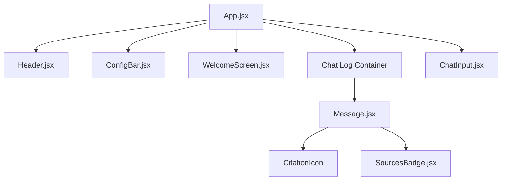
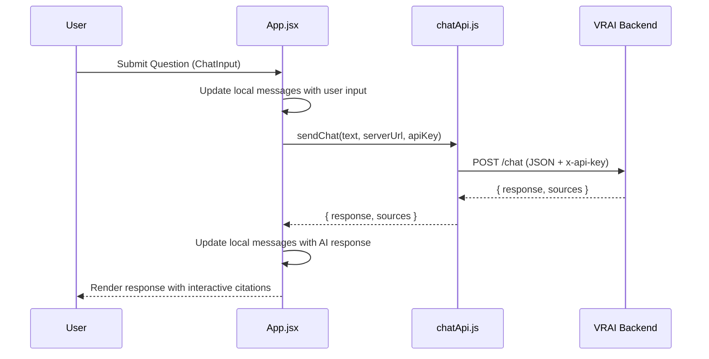

# ChatUI - VR Instructor Frontend

A React + Vite frontend application designed as the primary user interface for the VR Instructor RAG (Retrieval-Augmented Generation) system. This interface enables users to interact with a backend intelligence system, query field manuals, and view AI-generated responses complete with precise source citations and page references.

## Overview

The ChatUI provides a streamlined, professional chat experience tailored for technical documentation retrieval. It features a responsive design, real-time feedback, and an interactive citation system that allows users to verify AI responses against the original source material.

Key Capabilities:
- High-performance React frontend bundled with Vite.
- Real-time communication with the VRAI backend.
- Dynamic citation rendering with hoverable source details.
- Theme switching support (Dark/Light modes).
- Configurable backend connection settings.

## Replication Instructions

To recreate this environment locally or on a server, follow these steps:

### 1. Prerequisites
- Node.js (v18.0.0 or higher)
- npm (v9.0.0 or higher)
- Access to the VRAI backend server

### 2. Installation
Clone the repository and install the necessary dependencies:

```bash
git clone git@github.com:Rhabibi1609/ChatUI.git
cd ChatUI/vr-chat
npm install
```

### 3. Running the Project
Start the development server:

```bash
npm run dev
```

The application will be accessible at: http://localhost:3000

### 4. Production Build
To create an optimized production bundle:

```bash
npm run build
```

The resulting files will be in the dist/ directory, ready to be served by Nginx or any static file host.

## Port Configuration

The application is configured to run on port 3000 by default. This is defined in the vite.config.js file under the server section:

```javascript
server: {
  port: 3000,
  // ... proxy settings
}
```

If you are running this in a Docker container, the nginx.conf is also configured to listen on port 3000.

## Usage Instructions

### Connecting to the Backend
1. Once the UI is running, look at the top configuration bar (Config Bar).
2. Server URL: Enter the URL of your VRAI backend (e.g., https://cutrdnt.ddns.net/).
3. API Key: Enter your required API key in the API Key field. This key is used for the x-api-key header in all requests.

### Interacting with the Assistant
1. Type your question into the chat input at the bottom.
2. Press ENTER to send.
3. The system will display a "QUERYING MANUAL..." state while retrieving the answer.
4. When the response arrives, you will see the text along with numbered citation badges (e.g., [1]).
5. Hover over any citation badge to see the specific source name or page number referenced.

## What is What: Component Breakdown

### Core Files
- index.html: The entry point for the browser.
- src/main.jsx: Initializes React and mounts the App component.
- src/App.jsx: The root component. It manages the global state, including chat history, theme, and connection settings.
- src/api/chatApi.js: Handles all HTTP communication with the backend. It uses the Fetch API to send queries and receive sourced responses.

### Components (src/components/)
- Header.jsx: Displays the system title, logo, theme toggle, and connection status indicator.
- ConfigBar.jsx: Provides inputs for the Server URL and API Key. It updates the state in App.jsx.
- WelcomeScreen.jsx: Shown when the chat is empty. It provides suggested questions to help users get started.
- ChatInput.jsx: An auto-resizing textarea for user input. It handles the "Enter" key for submission.
- Message.jsx: Renders individual chat bubbles. It includes logic to parse citation markers like [1] and replace them with interactive CitationIcon components.
- SourcesBadge.jsx: Displays a summary of all sources referenced in a specific AI response.
- CitationIcon.jsx: The specific component used for inline citations within the message text.

### Styles (src/styles/)
- global.css: Contains base variables, fonts, and global layout styles.
- Header.css, Message.css, etc.: Component-specific styles ensuring a modular and maintainable design.

## Architecture Diagrams

### Component Hierarchy



### Data Flow Sequence



## Security and Keys

The application requires an API key to communicate with the backend. This key should be provided via the Config Bar in the UI.

- Placement: The key is stored in the React state and passed to every API call.
- Handling: In src/api/chatApi.js, the key is added to the x-api-key header of the fetch request.
- Persistence: Currently, the key is entered per session. For production environments, ensure you are using HTTPS to protect the key during transit.
