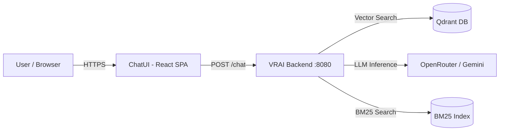
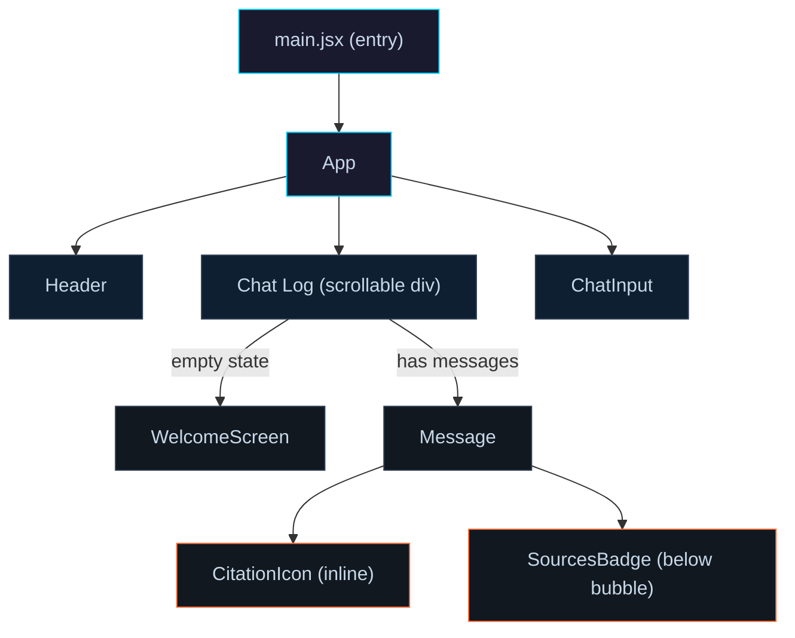
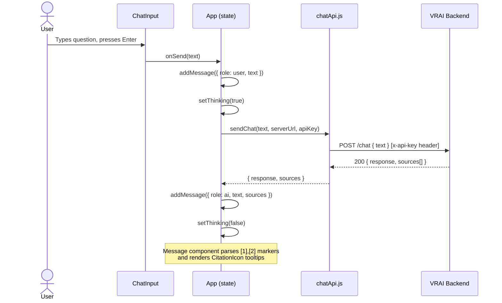

# ChatUI

Frontend for the VR Instructor RAG system. A single-page React application that connects to the VRAI backend, lets users ask natural-language questions against ingested railroad field manuals, and renders AI-generated answers with inline, hoverable source citations.

Built with React 18 and Vite 5. Ships with a multi-stage Dockerfile for production deployment behind Nginx.

---

## Table of Contents

- [Architecture Overview](#architecture-overview)
- [Directory Layout](#directory-layout)
- [Prerequisites](#prerequisites)
- [Local Development](#local-development)
- [Production Deployment](#production-deployment)
- [Configuration Reference](#configuration-reference)
- [API Key Setup](#api-key-setup)
- [How It Works](#how-it-works)
- [Component Reference](#component-reference)
- [Styling System](#styling-system)
- [CI/CD](#cicd)
- [Troubleshooting](#troubleshooting)

---

## Architecture Overview

### System Context



### Component Tree



### Request / Response Flow



---

## Directory Layout

```
vr-chat/
|-- index.html                 HTML shell, mounts #root
|-- package.json               Dependencies and npm scripts
|-- vite.config.js             Vite dev server, proxy rules, base path
|-- Dockerfile                 Multi-stage build (node:18 -> nginx:alpine)
|-- nginx.conf                 Production reverse proxy config
|-- .gitignore
|
|-- src/
|   |-- main.jsx               React entry point (StrictMode, createRoot)
|   |-- App.jsx                Root component, owns all global state
|   |
|   |-- api/
|   |   |-- chatApi.js         Single function: sendChat(text, url, key)
|   |
|   |-- components/
|   |   |-- Header.jsx         Top bar: logo, title, theme toggle, status dot
|   |   |-- ConfigBar.jsx      Server URL + API Key input fields
|   |   |-- WelcomeScreen.jsx  Empty-state view with 4 suggested prompts
|   |   |-- ChatInput.jsx      Auto-resizing textarea + send button
|   |   |-- Message.jsx        Chat bubble renderer + citation parser
|   |   |-- SourcesBadge.jsx   Expandable source list below AI messages
|   |
|   |-- styles/
|       |-- global.css         CSS variables, fonts, reset, scrollbar
|       |-- Header.css         Header bar styling
|       |-- ConfigBar.css      Config input styling
|       |-- Welcome.css        Welcome screen card grid
|       |-- ChatInput.css      Input area and hint text
|       |-- Message.css        Bubbles, avatars, tooltips, thinking dots
|
|-- .github/
    |-- workflows/
        |-- master_ragchatui-app.yml   Azure deployment on push to master
```

---

## Prerequisites

| Requirement | Minimum Version | Purpose |
|---|---|---|
| Node.js | 18.x | Runtime for Vite and React |
| npm | 9.x | Package management |
| VRAI Backend | Running instance | Serves /chat, /health, /tts endpoints |
| Docker (optional) | 20.x | Container-based production deployment |

---

## Local Development

### 1. Clone and install

```bash
git clone git@github.com:Rhabibi1609/ChatUI.git
cd ChatUI/vr-chat
npm install
```

### 2. Start the dev server

```bash
npm run dev
```

Vite starts on **port 3000**. Open `http://localhost:3000` in your browser.

The dev server proxies three API routes to `https://cutrdnt.ddns.net/` automatically, so you do not need to configure CORS or a separate reverse proxy during development:

| Route | Proxied To |
|---|---|
| `/chat_compare` | `https://cutrdnt.ddns.net/chat_compare` |
| `/tts` | `https://cutrdnt.ddns.net/tts` |
| `/health` | `https://cutrdnt.ddns.net/health` |

These proxy rules are defined in `vite.config.js` under `server.proxy`.

### 3. Preview a production build locally

```bash
npm run build      # outputs to dist/
npm run preview    # serves dist/ on a local port
```

---

## Production Deployment

### Option A: Docker (recommended)

The included Dockerfile uses a two-stage build:

1. **Build stage** - `node:18-alpine` runs `npm install` and `npm run build`, producing optimized static files in `/app/dist`.
2. **Serve stage** - `nginx:alpine` copies the built files and the custom `nginx.conf` to serve them.

```bash
docker build -t chatui .
docker run -d -p 3000:3000 chatui
```

The Nginx config (`nginx.conf`) does three things:

- Serves the SPA from `/usr/share/nginx/html` with `try_files` fallback for client-side routing.
- Proxies `/chat_compare`, `/tts`, and `/health` to `http://127.0.0.1:8080` (the VRAI backend, expected to be on the same host or network).
- Listens on **port 3000**.

If your backend runs on a different host or port, edit the `proxy_pass` directives in `nginx.conf` before building.

### Option B: Static hosting

Run `npm run build` and upload the `dist/` folder to any static host (Netlify, Vercel, S3, etc.). You will need to configure your own reverse proxy or CORS headers to reach the backend.

---

## Configuration Reference

### vite.config.js

| Setting | Value | Purpose |
|---|---|---|
| `base` | `/ChatUI/` | Asset prefix for GitHub Pages / sub-path deployments |
| `server.port` | `3000` | Dev server listen port |
| `server.proxy` | See table above | Routes API calls to the backend during development |

### nginx.conf

| Setting | Value | Purpose |
|---|---|---|
| `listen` | `3000` | Container listen port |
| `root` | `/usr/share/nginx/html` | Where the built SPA is served from |
| `proxy_pass` | `http://127.0.0.1:8080` | Backend address for /chat_compare, /tts, /health |

### Environment variables

This project does not use `.env` files. The API key and server URL are hardcoded directly in `App.jsx` (lines 28-29). The `.gitignore` includes `.env` and `.env.local` in case you add environment-based config in the future.

---

## API Key Setup

The VRAI backend requires an `x-api-key` header on every request. Here is how the key flows through the application:

1. **API key is hardcoded** in `App.jsx` line 29 as the default value of the `apiKey` state.
2. **Server URL is left empty** in `App.jsx` line 28 -- requests go to the same origin, which Vite (dev) or Nginx (production) proxies to the backend.
3. **chatApi.js attaches the key** as the `x-api-key` header in the fetch call to the backend.

```
App.jsx state: apiKey (hardcoded default)
        |
        v
chatApi.js: headers['x-api-key'] = apiKey
        |
        v
fetch('/chat') --> Vite proxy / Nginx --> Backend at :8080
```

To change the API key or server URL, edit these lines in `src/App.jsx`:

```javascript
const [serverUrl, setServerUrl] = useState('');        // line 28
const [apiKey, setApiKey]       = useState('YOUR_KEY'); // line 29
```

Important notes:
- The API key is hardcoded in source. Do not commit production keys to public repositories.
- The server URL being empty means all API calls use relative paths (`/chat`), which the proxy layer resolves.
- Always serve the application over **HTTPS** in production to protect the key in transit.
- A `ConfigBar` component exists in the codebase (`src/components/ConfigBar.jsx`) that provides UI inputs for the server URL and API key, but it is **not currently rendered**. See the ConfigBar entry in the Component Reference for wiring instructions.

---

## How It Works

### Startup

`main.jsx` calls `createRoot` on the `#root` div in `index.html` and renders `<App />` inside React `StrictMode`.

### State management

All state lives in `App.jsx` via `useState` hooks. There is no external state library.

| State variable | Type | Purpose |
|---|---|---|
| `serverUrl` | string | Backend URL, defaults to empty (uses same-origin proxy) |
| `apiKey` | string | API key, hardcoded default in source |
| `messages` | array | Chat history: `{ id, role, text, sources?, isError? }` |
| `thinking` | boolean | Controls the loading indicator |
| `theme` | string | `'dark'` or `'light'`, persisted to localStorage |

### Message lifecycle

1. User types a question and presses Enter (or clicks send).
2. `ChatInput` calls `onSend(text)`.
3. `App.handleSend` appends a user message to the `messages` array, sets `thinking = true`.
4. `sendChat()` in `chatApi.js` fires a `POST` to `{serverUrl}/chat` with `{ text }` in the body and `x-api-key` in the headers.
5. The backend responds with `{ response: string, sources: array }`.
6. `chatApi.js` normalizes the response (handles string, array-of-blocks, and object formats).
7. An AI message is appended to `messages` with the response text and sources.
8. `thinking` is set to `false`.

### Citation rendering

`Message.jsx` contains a `formatTextWithCitations` function that uses a regex (`/\[[\d,\s]+\]/g`) to find citation markers like `[1]`, `[2,3]` in the AI response text. Each match is replaced with a `<CitationIcon>` component that renders a small paperclip icon. Hovering over the icon shows a tooltip with the source name, page number, and content excerpt pulled from the `sources` array.

### Theme switching

`Header.jsx` renders a sun/moon toggle button. Clicking it calls `toggleTheme()` in `App.jsx`, which flips the `theme` state between `'dark'` and `'light'`. A `useEffect` writes the value to `localStorage` and sets a `data-theme` attribute on the `<html>` element. `global.css` defines two sets of CSS custom properties (one under `:root`, one under `:root[data-theme='light']`) that cascade to all components.

---

## Component Reference

### App.jsx (104 lines)

The root component. Renders `Header`, the chat log area (a scrollable div), and `ChatInput`. Owns all state. Auto-scrolls the chat log to the bottom whenever `messages` or `thinking` changes via a `useEffect` on `logRef`.

### Header.jsx (51 lines)

Top bar with three sections:
- **Left**: SVG grid logo.
- **Center**: Title ("VR Instructor") and subtitle ("FIELD MANUAL INTELLIGENCE SYSTEM // RAG-ENABLED").
- **Right**: Theme toggle button (sun/moon SVG) and a status indicator dot with "SYSTEM ONLINE" text.

### ConfigBar.jsx (27 lines)

Two inputs side by side:
- **Server URL**: Text input. Placeholder: `http://localhost:8080`. Bound to `serverUrl` state in App.
- **API Key**: Password input. Placeholder: `x-api-key value`. Bound to `apiKey` state in App.

Note: ConfigBar is defined in the codebase but is not currently rendered in `App.jsx`. To enable it, add `<ConfigBar serverUrl={serverUrl} apiKey={apiKey} onServerChange={setServerUrl} onApiKeyChange={setApiKey} />` inside the App return, between `<Header />` and the chat log div.

### WelcomeScreen.jsx (38 lines)

Displayed when the message list is empty. Shows a clock icon, title ("Field Manual Assistant"), a description, and a 2x2 grid of suggestion buttons categorized as Operations, Signals, Safety, and Procedures. Clicking a suggestion calls `onSuggestion(question)`, which triggers the same flow as typing and sending.

### ChatInput.jsx (61 lines)

Bottom input area with:
- An auto-resizing `<textarea>` (max height 200px, max length 2000 chars).
- A send button with an arrow SVG.
- A hint line: "ENTER to send * SHIFT+ENTER for newline * Hover (+) badge to see source references".

Enter sends the message. Shift+Enter inserts a newline.

### Message.jsx (112 lines)

Renders a single chat bubble. Two exported components:
- `ThinkingMessage` - Three animated dots with "QUERYING MANUAL..." text. Shown while `thinking` is true.
- `Message` - Renders user or AI messages with role-based styling. AI messages pass through `formatTextWithCitations()` which replaces `[N]` markers with interactive `CitationIcon` tooltips. Error messages are prefixed with `[ERROR]`.

### SourcesBadge.jsx (60 lines)

Rendered below AI messages that have sources. Displays a row of small buttons, one per source. Each button shows an info icon and label. Clicking a button toggles a tooltip showing the source heading and content. Clicking outside the component closes any open tooltip.

### chatApi.js (45 lines)

Single exported function: `sendChat(text, serverUrl, apiKey)`.

- Sends `POST {serverUrl}/chat` with `{ text }` body.
- Attaches `x-api-key` header if `apiKey` is provided.
- Handles three response shapes: plain string, array of content blocks (`[{ type, text }]`), or object with `.text`.
- Returns `{ response: string, sources: array }`.

---

## Styling System

The UI uses vanilla CSS with CSS custom properties for theming. No CSS framework.

### Design tokens (global.css)

| Variable | Dark value | Light value | Usage |
|---|---|---|---|
| `--bg` | `#0a0c0f` | `#ffffff` | Page background |
| `--panel` | `#10141a` | `#f5f7fa` | Card/panel backgrounds |
| `--accent` | `#00d4ff` | `#007bff` | Primary accent (cyan / blue) |
| `--accent2` | `#ff6b35` | `#e65a28` | Secondary accent (orange) |
| `--text` | `#c8d8e8` | `#1a202c` | Primary text |
| `--text-dim` | `#5a7080` | `#4a5568` | Secondary text |
| `--mono` | Share Tech Mono | - | Monospace font |
| `--sans` | Barlow | - | Primary sans-serif font |
| `--cond` | Barlow Condensed | - | Condensed headings font |

### Visual effects

- **Scanline overlay**: A subtle repeating gradient on `body::before` creates a CRT-style scanline effect (dark mode only).
- **Custom scrollbar**: 4px wide, transparent track, accent-colored thumb.
- **Theme transitions**: CSS variables cascade instantly when the `data-theme` attribute changes.

---

## CI/CD and Deployment

### Oracle Cloud Infrastructure (OCI) -- Primary Production

The application runs in production on an Oracle Cloud VM behind the domain `cutrdnt.ddns.net`. Deployment is done manually via SSH and Docker:

```bash
# SSH into the OCI instance
ssh opc@<oci-instance-ip>

# Navigate to the project
cd /home/opc/ChatUI/vr-chat

# Pull latest changes
git pull origin master

# Rebuild and restart the container
docker build -t chatui .
docker stop chatui-container 2>/dev/null || true
docker rm chatui-container 2>/dev/null || true
docker run -d --name chatui-container --network host -p 3000:3000 chatui
```

The Docker container runs Nginx on port 3000, which serves the built SPA and proxies API routes (`/chat_compare`, `/tts`, `/health`) to the VRAI backend at `127.0.0.1:8080` on the same host.

Key OCI details:

| Item | Value |
|---|---|
| Instance type | Oracle Cloud VM (Always Free tier eligible) |
| OS | Oracle Linux / Ubuntu |
| Frontend port | 3000 (Nginx inside Docker) |
| Backend port | 8080 (VRAI server, same host) |
| Domain | `cutrdnt.ddns.net` (DDNS) |
| Reverse proxy | Nginx via `nginx.conf` in this repo |

Make sure the OCI security list / firewall allows inbound traffic on port 3000 (or whichever port you expose).

### Azure Web App -- Automated CI/CD

A GitHub Actions workflow (`.github/workflows/master_ragchatui-app.yml`) runs on every push to `master`:

1. Checks out the repository.
2. Sets up Node.js 20.x.
3. Runs `npm install` and `npm run build`.
4. Deploys to Azure Web App "RAGCHATUI" using the `AZURE_WEBAPP_PUBLISH_PROFILE` secret.

To use this workflow, add your Azure publish profile as a repository secret named `AZURE_WEBAPP_PUBLISH_PROFILE`. If you are only using OCI, you can disable or remove this workflow.

---

## Troubleshooting

| Problem | Cause | Fix |
|---|---|---|
| Blank page after build | `base` in vite.config.js does not match deployment path | Set `base` to `/` for root deployment or `/ChatUI/` for sub-path |
| CORS errors in browser | Dev proxy not running, or hitting backend directly | Run `npm run dev` (uses Vite proxy), or configure CORS on backend |
| "Connection failed" error | Wrong server URL or backend is down | Verify `serverUrl` in App.jsx and proxy config; test with `curl http://localhost:8080/health` |
| Citations not rendering | Backend returning unexpected response format | chatApi.js handles string, array, and object formats; check the raw response in DevTools Network tab |
| Theme not persisting | localStorage blocked | Check browser privacy settings; theme falls back to dark |
| Docker container 502 | Backend not reachable at 127.0.0.1:8080 | Edit `proxy_pass` in nginx.conf to match your backend address |

---

## Images


